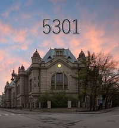

# Ответы на экзаменационные вопросы [ОргЭВМ, Холод, 2017]

Тут будут собраны ответы на все экзаменационные вопросы по дисциплине "Организация ЭВМ и систем" за 4-й семестр.

**Дисциплина:** Организация ЭВМ и систем

**Преподаватель:** Холод И.И.

**Год:** 2017

**Скачать книжку:**
[PDF](https://www.gitbook.com/download/pdf/book/fkti5301/exam_tickets-evm_2017_holod)
[EPUB](https://www.gitbook.com/download/epub/book/fkti5301/exam_tickets-evm_2017_holod)
[MOBI](https://www.gitbook.com/download/mobi/book/fkti5301/exam_tickets-evm_2017_holod)

[Онлайн версия](https://fkti5301.gitbooks.io/exam_tickets-evm_2017_holod/content/)

[Инструкция по заполнению](INSTRUCTION.md)

[Доклады](https://mega.nz/#F!2gJyECwR!ra3IYSFeYRypq-L_wlaCXA)

